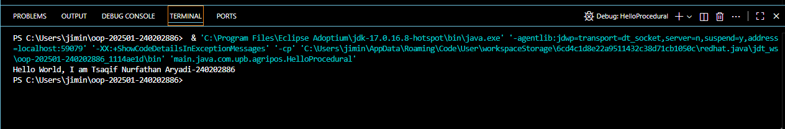
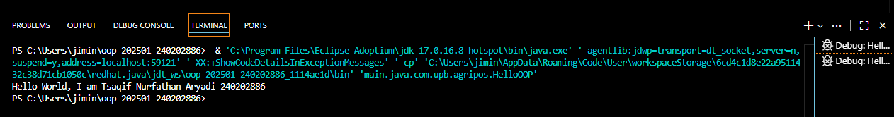
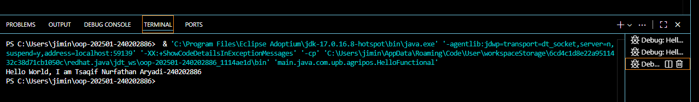

# Laporan Praktikum Minggu 1 (sesuaikan minggu ke berapa?)
Topik: [Tuliskan judul topik, misalnya "Class dan Object"]

## Identitas
- Nama  : [TSAQIF NURFATHAN ARYADI]
- NIM   : [240202886]
- Kelas : [3IKRB]

---

## Tujuan
- Mahasiswa mampu mendefinisikan paradigma prosedural, OOP, dan fungsional.
- Mahasiswa mampu membandingkan kelebihan dan keterbatasan tiap paradigma.
- Mahasiswa mampu memberikan contoh program sederhana untuk masing-masing paradigma.
- Mahasiswa aktif dalam diskusi kelas (bertanya, menjawab, memberi opini).
---

## Dasar Teori
1. Prosedural: program dibangun sebagai rangkaian perintah (fungsi/prosedur).
2. OOP (Object-Oriented Programming): program dibangun dari objek yang memiliki data (atribut) dan perilaku (method).
3. Fungsional: program dipandang sebagai pemetaan fungsi matematika, lebih menekankan ekspresi dan transformasi data.

---

## Langkah Praktikum
1. Setup Project
2. Program Sederhana dalam 3 Paradigma
3. Commit dan Push
---

## Kode Program
// HelloProcedural.java
public class HelloProcedural {
   public static void main(String[] args) {
      String nim = "240202886";
      String nama = "Tsaqif Nurfathan Aryadi";
      
      System.out.println("Hello World, I am" + " " + nama + "-" + nim);
   }
}

// HelloOOP.java
class Mahasiswa {
   String nama;
   String NIM;
   Mahasiswa(String nama, String NIM) {
      this.nama = nama;
      this.NIM = NIM;
   }
   void sapa(){ System.out.println("Hello World, I am" + " " + nama + "-" + NIM);}
}

public class HelloOOP {
   public static void main(String[] args) {
       Mahasiswa m = new Mahasiswa ("Tsaqif Nurfathan Aryadi", "240202886");
       m.sapa();
   }
}

// HelloFunctional.java
import java.util.function.BiConsumer;
public class HelloFunctional {
    public static void main(String[] args) {
        BiConsumer<String,String> sapa =
        (nama, NIM) -> System.out.println("Hello World, I am" + " " + nama + "-" + NIM);
        sapa.accept("Tsaqif Nurfathan Aryadi", "240202886");
    }
}

---

## Hasil Eksekusi
(Sertakan screenshot hasil eksekusi program.  

)
---

## Analisis
1. HelloOOP.java (Object-Oriented Programming)
Menggunakan kelas dan objek (Mahasiswa) untuk merepresentasikan entitas.
Data (nama, NIM) dan perilaku (sapa()) dibungkus dalam satu objek.
2. HelloFunctional.java (Functional Programming style)
Menggunakan fungsi sebagai data (lambda expression).
Tidak perlu membuat kelas atau objek, langsung fokus ke aksi (menyapa).
Cocok untuk operasi yang bersifat stateless dan tidak butuh penyimpanan data jangka panjang.
3. HelloProcedural.java (Procedural Programming)
Program berjalan secara urutan langkah-langkah langsung.
Sangat sederhana dan mudah dipahami.
Tidak ada struktur atau abstraksi data.
---

## Kesimpulan

Setiap paradigma memiliki keunggulan:

- OOP cocok untuk program kompleks dan terstruktur.
- Functional lebih ringkas dan fokus pada aksi.
- Procedural paling sederhana untuk tugas langsung.

---

## Quiz
1. Apakah OOP selalu lebih baik dari prosedural?
Jawaban: Tidak selalu. OOP lebih baik untuk aplikasi besar dan kompleks, sedangkan prosedural lebih efisien untuk program sederhana dan langsung.
2. Kapan functional programming lebih cocok digunakan dibanding OOP atau prosedural?
Jawaban: Functional programming lebih cocok saat menangani proses data yang kompleks, paralel, dan stateless, seperti pemrosesan data besar (big data), atau saat ingin menulis kode yang ringkas dan mudah diuji.
3. Bagaimana paradigma (prosedural, OOP, fungsional) memengaruhi maintainability dan scalability aplikasi?
Jawaban:
Prosedural: Sulit dipelihara dan diskalakan saat program tumbuh besar.
OOP: Mempermudah maintainability dan scalability dengan struktur modular dan reusable.
Functional: Memudahkan testing dan mengurangi bug, sehingga maintainability meningkat, terutama pada aplikasi dengan logika rumit.
4. Mengapa OOP lebih cocok untuk mengembangkan aplikasi POS dibanding prosedural?
Jawaban: Karena OOP memungkinkan pemodelan entitas seperti produk, transaksi, dan pelanggan dalam bentuk objek, sehingga lebih mudah untuk mengelola dan mengembangkan fitur POS secara terstruktur dan modular.
5. Bagaimana paradigma fungsional dapat membantu mengurangi kode berulang (boilerplate code)?
Jawaban: Dengan menggunakan fungsi murni, lambda, dan higher-order functions, kode dapat ditulis lebih ringkas tanpa perlu deklarasi kelas/metode berulang, sehingga mengurangi duplikasi.