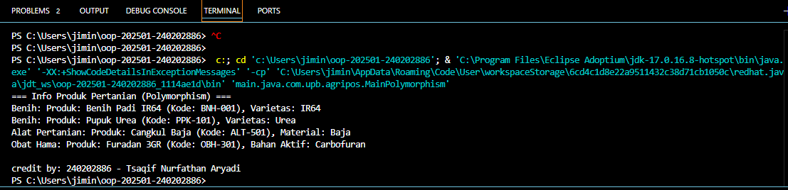

# Laporan Praktikum Minggu 1 (sesuaikan minggu ke berapa?)
Topik: [Tuliskan judul topik, misalnya "Class dan Object"]

## Identitas
- Nama  : [Tsaqif Nurfathan Aryadi]
- NIM   : [240202886]
- Kelas : [3IKRB]

---

## Tujuan
Mahasiswa mampu **menjelaskan konsep polymorphism** dalam OOP.  
- Mahasiswa mampu **membedakan method overloading dan overriding**.  
- Mahasiswa mampu **mengimplementasikan polymorphism (overriding, overloading, dynamic binding)** dalam program.  
- Mahasiswa mampu **menganalisis contoh kasus polymorphism** pada sistem nyata (Agri-POS).  

---

## Dasar Teori
Polymorphism berarti “banyak bentuk” dan memungkinkan objek yang berbeda merespons panggilan method yang sama dengan cara yang berbeda.  
1. **Overloading** → mendefinisikan method dengan nama sama tetapi parameter berbeda.  
2. **Overriding** → subclass mengganti implementasi method dari superclass.  
3. **Dynamic Binding** → pemanggilan method ditentukan saat runtime, bukan compile time.  

Dalam konteks Agri-POS, misalnya:  
- Method `getInfo()` pada `Produk` dioverride oleh `Benih`, `Pupuk`, `AlatPertanian` untuk menampilkan detail spesifik.  
- Method `tambahStok()` bisa dibuat overload dengan parameter berbeda (int, double)

---

## Langkah Praktikum
1. **Overloading**  
   - Tambahkan method `tambahStok(int jumlah)` dan `tambahStok(double jumlah)` pada class `Produk`.  

2. **Overriding**  
   - Tambahkan method `getInfo()` pada superclass `Produk`.  
   - Override method `getInfo()` pada subclass `Benih`, `Pupuk`, dan `AlatPertanian`.  

3. **Dynamic Binding**  
   - Buat array `Produk[] daftarProduk` yang berisi objek `Benih`, `Pupuk`, dan `AlatPertanian`.  
   - Loop array tersebut dan panggil `getInfo()`. Perhatikan bagaimana Java memanggil method sesuai jenis objek aktual.  

4. **Main Class**  
   - Buat `MainPolymorphism.java` untuk mendemonstrasikan overloading, overriding, dan dynamic binding.  

5. **CreditBy**  
   - Tetap panggil `CreditBy.print("<NIM>", "<Nama>")`.  

6. **Commit dan Push**  
   - Commit dengan pesan: `week4-polymorphism

## Kode Program
public class Pupuk extends Produk {
    private String jenis;

    public Pupuk(String kode, String nama, double harga, int stok, String jenis) {
        super(kode, nama, harga, stok);
        this.jenis = jenis;
    }

    public String getJenis() {
        return jenis;
    }

    public void setJenis(String jenis) {
        this.jenis = jenis;
    }

    @Override
    public String getInfo() {
        return "Pupuk: " + super.getInfo() + ", Jenis: " + jenis;
    }

}

public class Produk {
    private String kode;
    private String nama;
    private double harga;
    private int stok;

    public Produk(String kode, String nama, double harga, int stok) {
        this.kode = kode;
        this.nama = nama;
        this.harga = harga;
        this.stok = stok;
    }

    public void tambahStok(int jumlah) {
        this.stok += jumlah;
    }

    public void tambahStok(double jumlah) {
        this.stok += (int) jumlah;
    }

    public String getInfo() {
        return "Produk: " + nama + " (Kode: " + kode + ")";
    }
}

public class ObatHama extends Produk {
    private String bahanAktif;

    public ObatHama(String kode, String nama, double harga, int stok, String bahanAktif) {
        super(kode, nama, harga, stok);
        this.bahanAktif = bahanAktif;
    }

    public String getBahanAktif() {
        return bahanAktif;
    }

    public void setBahanAktif(String bahanAktif) {
        this.bahanAktif = bahanAktif;
    }

    @Override
    public String getInfo() {
        return "Obat Hama: " + super.getInfo() + ", Bahan Aktif: " + bahanAktif;
    }
}

public class MainPolymorphism {
    public static void main(String[] args) {
        Produk[] daftarProduk = {
            new Benih("BNH-001", "Benih Padi IR64", 25000, 100, "IR64"),
            new Benih("PPK-101", "Pupuk Urea", 350000, 40, "Urea"),
            new AlatPertanian("ALT-501", "Cangkul Baja", 90000, 15, "Baja"),
            new ObatHama("OBH-301", "Furadan 3GR", 50000, 25, "Carbofuran")
        };

        System.out.println("=== Info Produk Pertanian (Polymorphism) ===");
        for (Produk p : daftarProduk) {
            System.out.println(p.getInfo()); // Dynamic Binding
        }

        CreaditBy.print("240202886", "Tsaqif Nurfathan Aryadi");
    }
}

public class CreaditBy {
    public static void print(String nim, String nama) {
        System.out.println("\ncredit by: " + nim + " - " + nama);
    }
}

public class Benih extends Produk {
    private String varietas;

    public Benih(String kode, String nama, double harga, int stok, String varietas) {
        super(kode, nama, harga, stok);
        this.varietas = varietas;
    }

    @Override
    public String getInfo() {
        return "Benih: " + super.getInfo() + ", Varietas: " + varietas;
    }
}

public class AlatPertanian extends Produk {
    private String material;

    public AlatPertanian(String kode, String nama, double harga, int stok, String material) {
        super(kode, nama, harga, stok);
        this.material = material;
    }

    public String getMaterial() { 
        return material; 
    }
    public void setMaterial(String material) { 
        this.material = material; 
    }
    @Override
    public String getInfo() {
        return "Alat Pertanian: " + super.getInfo() + ", Material: " + material;
    }

}
---

## Hasil Eksekusi
(Sertakan screenshot hasil eksekusi program.  

)
---

## Analisis
Kode yang diberikan merupakan implementasi dari konsep pemrograman berorientasi objek (OOP) di Java, dengan menggunakan pewarisan untuk menggambarkan berbagai jenis produk dalam sistem pertanian. Kelas Produk bertindak sebagai kelas dasar yang mendefinisikan atribut umum seperti kode, nama, harga, dan stok produk. Kelas-kelas turunan seperti Pupuk, ObatHama, Benih, dan AlatPertanian mewarisi kelas Produk dan menambahkan atribut serta metode khusus yang sesuai dengan jenis produk masing-masing. Misalnya, kelas Pupuk menambahkan atribut jenis untuk mengindikasikan tipe pupuk, sementara ObatHama memiliki atribut bahanAktif untuk menyimpan informasi tentang bahan aktif dalam obat hama. Setiap kelas turunan juga meng-override metode getInfo() untuk memberikan deskripsi rinci tentang produk, sesuai dengan jenisnya. Dengan cara ini, kode ini menerapkan prinsip polimorfisme untuk memberikan variasi perilaku yang berbeda meskipun menggunakan nama metode yang sama. Pendekatan ini memungkinkan kode yang lebih terstruktur, fleksibel, dan mudah untuk dikembangkan lebih lanjut.
---

## Kesimpulan
Kesimpulan dari kode yang diberikan adalah bahwa implementasi ini menunjukkan penerapan prinsip pemrograman berorientasi objek (OOP) dalam pengelolaan berbagai jenis produk dalam sistem pertanian. Dengan menggunakan pewarisan, kelas Produk menjadi kelas dasar yang menyimpan atribut umum, sementara kelas-kelas turunan seperti Pupuk, ObatHama, Benih, dan AlatPertanian menambahkan atribut spesifik dan meng-override metode untuk menyajikan informasi yang lebih detail. Polimorfisme diterapkan dengan cara metode getInfo() yang memiliki perilaku berbeda pada setiap kelas turunan, memberikan fleksibilitas dan memperjelas perbedaan antar produk. Secara keseluruhan, desain ini mendukung pengelolaan produk yang lebih modular dan dapat diperluas, memudahkan pengembangan sistem yang lebih besar dan kompleks di masa depan.
---

## Quiz
(1. Apa perbedaan overloading dan overriding?
   Overloading adalah kondisi di mana dua atau lebih method dalam satu kelas memiliki nama yang sama tetapi berbeda dalam jumlah atau tipe parameternya. Tujuannya untuk memberikan fleksibilitas pemanggilan method dengan berbagai argumen. Contohnya, method tambahStok(int jumlah) dan tambahStok(double jumlah) pada kelas Produk adalah bentuk method overloading.
   Sedangkan overriding adalah kondisi ketika kelas turunan mendefinisikan kembali method yang sudah ada di kelas induk dengan nama, parameter, dan tipe kembalian yang sama, namun dengan isi (implementasi) yang berbeda. Tujuannya untuk menyesuaikan perilaku method agar sesuai dengan kebutuhan kelas turunan. Misalnya, method getInfo() pada kelas Pupuk, Benih, dan ObatHama adalah hasil method overriding dari getInfo() di kelas Produk.

2. Bagaimana Java menentukan method mana yang dipanggil dalam dynamic binding? 
   Dalam dynamic binding (atau late binding), Java menentukan method mana yang dipanggil pada saat program dijalankan (runtime), bukan saat kompilasi. Ketika sebuah objek direferensikan melalui tipe superclass, tetapi objek sebenarnya merupakan instance dari subclass, Java akan memanggil method yang sesuai dengan tipe objek sebenarnya, bukan tipe referensinya. Misalnya, jika kita memiliki Produk p = new Pupuk(...);, lalu memanggil p.getInfo(), maka yang dieksekusi adalah method getInfo() dari kelas Pupuk, bukan dari Produk. Mekanisme ini memungkinkan penerapan polimorfisme secara dinamis di Java 

3. Berikan contoh kasus polymorphism dalam sistem POS selain produk pertanian  
   Contoh penerapan polymorphism dalam sistem Point of Sale (POS) di luar konteks produk pertanian adalah pada sistem penjualan di toko elektronik. Misalnya, terdapat kelas dasar Barang dengan method getInfo(), lalu kelas turunan seperti Televisi, Laptop, dan Smartphone masing-masing meng-override method tersebut untuk menampilkan informasi spesifik, seperti ukuran layar pada Televisi, kapasitas penyimpanan pada Laptop, dan jenis prosesor pada Smartphone. Saat sistem menampilkan daftar produk menggunakan array atau list bertipe Barang, Java akan memanggil getInfo() sesuai dengan jenis objek sebenarnya, meskipun semuanya disimpan dalam satu struktur data bertipe Barang.)
