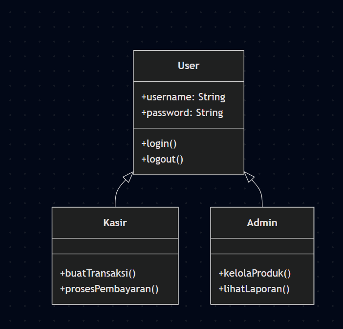
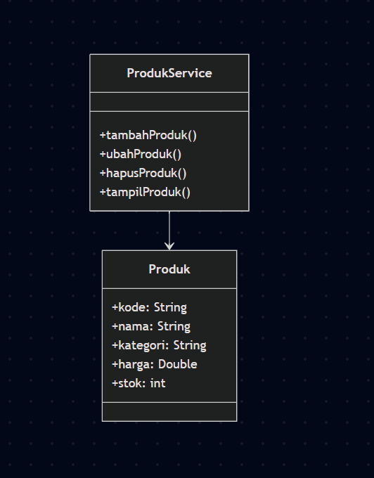
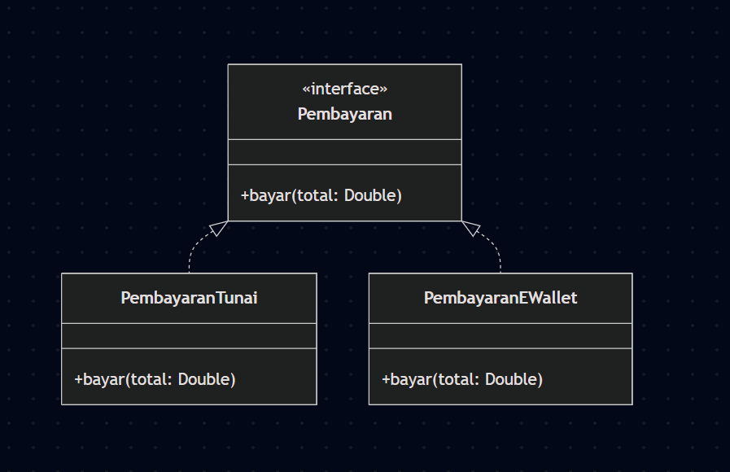
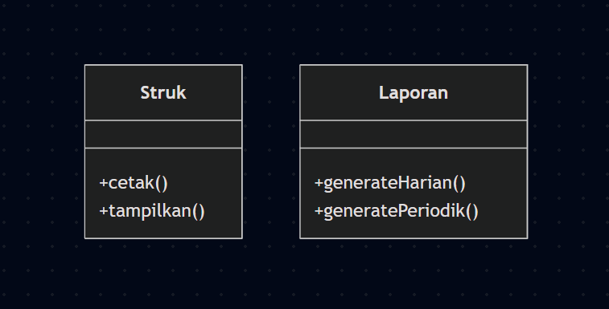
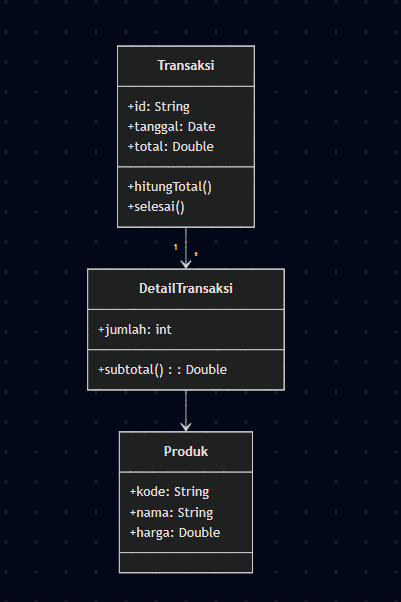

# Laporan Praktikum Minggu 1 (sesuaikan minggu ke berapa?)
Topik: [Tuliskan judul topik, misalnya "Class dan Object"]

## Identitas
- Nama  : Tsaqif Nurfathan Aryadi
- NIM   : 240202886
- Kelas : 3IKRB

---

## Tujuan
Tujuan praktikum minggu ke-6 adalah:

1.Mahasiswa mampu memahami konsep dasar permodelan UML.

2.Mahasiswa mampu membuat diagram Activity, Class, Sequence, dan Use Case secara benar.

3.Mahasiswa mampu menerapkan prinsip SOLID ke dalam desain perangkat lunak.

4.Mahasiswa mampu menghubungkan desain UML dengan implementasi kode program.

## Dasar Teori
1.UML (Unified Modeling Language) adalah bahasa standar untuk memodelkan sistem perangkat lunak melalui diagram visual seperti Activity, Class, Sequence, dan Use Case.

2.Activity Diagram menggambarkan alur proses dari awal sampai akhir.

3.Class Diagram menjelaskan struktur kelas, atribut, method, dan relasi antarkelas.

4.Sequence Diagram memperlihatkan interaksi objek secara berurutan dalam waktu.

5.SOLID adalah lima prinsip desain OOP yang membuat sistem lebih modular, mudah diperluas, dan mudah diuji.

## Langkah Praktikum
1.Membuat folder proyek berisi struktur src di VS Code.

2.Menginstall Mermaid CLI atau menggunakan ekstensi Markdown untuk merender diagram UML.

3.Membuat masing-masing file:

activity.mmd
class.mmd
sequence.mmd
usecase.mmd
4.Menuliskan kode UML Mermaid untuk setiap diagram.

5.Render diagram menjadi gambar .png

## Kode Program

## Hasil Eksekusi
(Sertakan screenshot hasil eksekusi program.  

)
---

## Analisis
1.Kode memanfaatkan interface PaymentMethod sehingga setiap jenis pembayaran (tunai, e-wallet, kartu) dapat diimplementasikan tanpa mengubah class utama (Open/Closed Principle).
2.Pendekatan minggu ini lebih terstruktur karena harus membuat diagram UML lengkap sebelum coding. Hal ini membuat implementasi lebih mudah dipahami, terencana, dan konsisten dengan prinsip SOLID.
3.Kendala yang dihadapi:
Instalasi Mermaid CLI mengeluarkan warning deprecated, namun tidak mengganggu proses.
Diagram perlu diperbaiki agar sesuai standar UML (misal menambahkan decision node & swimlane).
4.Cara mengatasi:
Membaca ulang dokumentasi Mermaid, memperbaiki struktur diagram.
Menggunakan Markdown Mermaid Preview agar mudah melihat hasilnya secara langsung.

## Kesimpulan
Dengan menerapkan UML dan prinsip SOLID, desain sistem menjadi lebih rapi, mudah dipahami, dan dapat dikembangkan tanpa merusak struktur yang sudah ada. Diagram UML membantu memvisualisasikan alur, hubungan antarkelas, interaksi objek, dan kebutuhan fungsional dengan lebih jelas.
---

## Quiz
1.Jelaskan perbedaan aggregation dan composition serta berikan contoh penerapannya pada desain Anda. Jawaban: …

Aggregation adalah hubungan “bagian dari” tetapi objek masih bisa berdiri sendiri. Contoh: Kasir memiliki Produk—produk tetap ada walau kasir berhenti bekerja.
Composition adalah hubungan “bagian dari” yang sangat kuat. Jika objek induk dihapus, objek anak ikut hilang. Contoh: Transaksi memiliki DaftarItem. Jika transaksi dihapus, daftar item juga hilang.
2.Bagaimana prinsip Open/Closed dapat memastikan sistem mudah dikembangkan? Jawaban: …
Prinsip OCP menyatakan bahwa class harus terbuka untuk ekstensi tetapi tertutup untuk modifikasi. Artinya, kita dapat menambahkan fitur baru tanpa mengubah kode lama.Contoh pada sistem: menambah metode pembayaran baru QRISPayment tanpa mengubah class PaymentProcessor.

3.Mengapa Dependency Inversion Principle (DIP) meningkatkan testability? Berikan contoh penerapannya. Jawaban: …
DIP mengharuskan class bergantung pada abstraksi, bukan implementasi konkret. Karena itu, kita bisa mengganti implementasi dengan mock/fake saat testing.

Contoh: PaymentProcessor bergantung pada interface PaymentMethod, sehingga pada unit test kita dapat membuat:

class FakePaymentMethod implements PaymentMethod { public boolean pay(double amount) { return true; } }

Sehingga program lebih mudah dites tanpa mengubah kode asli.