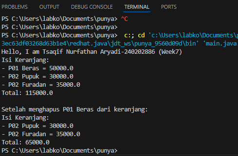
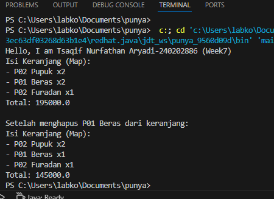

Laporan Praktikum Minggu 7
Topik: Collections dan Implementasi Keranjang BelanjaGIT

## Identitas
- Nama  : Tsaqif NUrfathan Aryadi
- NIM   : 240202886
- Kelas : 3IKRB

---

## Tujuan
1.Menjelaskan konsep collection dalam Java (List, Map, Set).
2.Menggunakan ArrayList untuk menyimpan dan mengelola objek.
3.Mengimplementasikan Map atau Set sesuai kebutuhan pengelolaan data.
4.Melakukan operasi dasar pada collection: tambah, hapus, dan hitung total.
5.Menganalisis efisiensi penggunaan collection dalam konteks sistem Agri-POS.

## Dasar Teori
Collections Framework
Java Collections Framework menyediakan struktur data untuk mengelola objek secara dinamis dan efisien.

Struktur utama:

List (implementasi: ArrayList) — Terurut, dapat menyimpan elemen duplikat.
Map (implementasi: HashMap) — Menyimpan pasangan key–value, akses cepat berdasarkan key.
Set (implementasi: HashSet) — Tidak menerima duplikat dan tidak mempertahankan urutan.
2. Studi Kasus: Keranjang Belanja Agri-POS
Keranjang belanja harus dapat:

Menambahkan produk
Menghapus produk
Menampilkan isi keranjang
Menghitung total nilai transaksi
Menangani jumlah (quantity) menggunakan Map
Kasus ini mencerminkan penggunaan struktur data dalam aplikasi nyata seperti POS.
---

## Langkah Praktikum
(Tuliskan Langkah-langkah dalam prakrikum, contoh:
1. Langkah-langkah yang dilakukan (setup, coding, run).  
2. File/kode yang dibuat.  
3. Commit message yang digunakan.)

---

## Kode Program
package main.java.com.upb.agripos;

public class MainCart {
    public static void main(String[] args) {
        System.out.println("Hello, I am Tsaqif Nurfathan Aryadi-240202886 (Week7)");

        Product p1 = new Product("P01", "Beras", 50000);
        Product p2 = new Product("P02", "Pupuk", 30000);
        Product p3 = new Product("P02", "Furadan", 35000);

        ShoppingCart cart = new ShoppingCart();
        cart.addProduct(p1);
        cart.addProduct(p2);
        cart.addProduct(p3);
        cart.printCart();

        System.out.println("\nSetelah menghapus " + p1.getCode() + " " + p1.getName() + " dari keranjang:");
        cart.removeProduct(p1);
        cart.printCart();
    }
}

package main.java.com.upb.agripos;

public class MainCartMap {
    public static void main(String[] args) {
        System.out.println("Hello, I am Tsaqif Nurfathan Aryadi-240202886 (Week7)");

        Product p1 = new Product("P01", "Beras", 50000);
        Product p2 = new Product("P02", "Pupuk", 30000);
        Product p3 = new Product("P02", "Furadan", 35000);

        ShoppingCartMap cart = new ShoppingCartMap();
        cart.addProduct(p1);
        cart.addProduct(p1);
        cart.addProduct(p2);
        cart.addProduct(p2);
        cart.addProduct(p3);
        cart.printCart();

        System.out.println("\nSetelah menghapus " + p1.getCode() + " " + p1.getName() + " dari keranjang:");
        cart.removeProduct(p1);
        cart.printCart();
    }
}

package main.java.com.upb.agripos;

public class Product {
    private final String code;
    private final String name;
    private final double price;

    public Product(String code, String name, double price) {
        this.code = code;
        this.name = name;
        this.price = price;
    }

    public String getCode() { return code; }
    public String getName() { return name; }
    public double getPrice() { return price; }
}

package main.java.com.upb.agripos;

import java.util.ArrayList;

public class ShoppingCart {
    private final ArrayList<Product> items = new ArrayList<>();

    public void addProduct(Product p) { items.add(p); }
    public void removeProduct(Product p) { items.remove(p); }

    public double getTotal() {
        double sum = 0;
        for (Product p : items) {
            sum += p.getPrice();
        }
        return sum;
    }

    public void printCart() {
        System.out.println("Isi Keranjang:");
        for (Product p : items) {
            System.out.println("- " + p.getCode() + " " + p.getName() + " = " + p.getPrice());
        }
        System.out.println("Total: " + getTotal());
    }
}

package main.java.com.upb.agripos;

import java.util.HashMap;
import java.util.Map;

public class ShoppingCartMap {
    private final Map<Product, Integer> items = new HashMap<>();

    public void addProduct(Product p) { items.put(p, items.getOrDefault(p, 0) + 1); }

    public void removeProduct(Product p) {
        if (!items.containsKey(p)) return;
        int qty = items.get(p);
        if (qty > 1) items.put(p, qty - 1);
        else items.remove(p);
    }

    public double getTotal() {
        double total = 0;
        for (Map.Entry<Product, Integer> entry : items.entrySet()) {
            total += entry.getKey().getPrice() * entry.getValue();
        }
        return total;
    }

    public void printCart() {
        System.out.println("Isi Keranjang (Map):");
        for (Map.Entry<Product, Integer> e : items.entrySet()) {
            System.out.println("- " + e.getKey().getCode() + " " + e.getKey().getName() + " x" + e.getValue());
        }
        System.out.println("Total: " + getTotal());
    }
}

---

## Hasil Eksekusi
(Sertakan screenshot hasil eksekusi program.  

)
---

## Analisis
Jelaskan bagaimana kode berjalan.
program dijalankan dimulai dari method main() pada class MainCart, di mana objek Product dibuat sebagai data produk dan objek ShoppingCart dibuat sebagai keranjang belanja. Keranjang menggunakan ArrayList untuk menyimpan produk secara dinamis, sehingga produk dapat ditambahkan dan dihapus dengan mudah melalui method addProduct() dan removeProduct(). Saat printCart() dipanggil, program melakukan perulangan untuk menampilkan seluruh isi keranjang dan memanggil method getTotal() yang menjumlahkan harga setiap produk di dalam collection. Setelah suatu produk dihapus, keranjang ditampilkan kembali dengan total harga yang otomatis diperbarui, sehingga alur program mencerminkan proses dasar transaksi pada sistem POS.

Apa perbedaan pendekatan minggu ini dibanding minggu sebelumnya.
Pendekatan pengelolaan data. Minggu sebelumnya (Bab 6) lebih berfokus pada perancangan sistem menggunakan UML dan prinsip SOLID, sehingga penekanan ada pada struktur class, pembagian tanggung jawab, dan desain sebelum penulisan kode. Sementara itu, pada Bab 7 fokus berpindah ke implementasi teknis menggunakan Java Collections, khususnya ArrayList dan Map, untuk mengelola banyak objek secara dinamis.

Kendala yang dihadapi dan cara mengatasinya.
_

---

## Kesimpulan
Penggunaan Java Collections seperti ArrayList dan Map memudahkan pengelolaan data produk dalam keranjang belanja secara dinamis. Program mampu melakukan operasi tambah, hapus, dan hitung total dengan lebih efisien dan terstruktur. Bab ini melengkapi materi sebelumnya dengan menunjukkan penerapan desain yang sudah direncanakan menjadi implementasi nyata, sehingga mahasiswa tidak hanya memahami konsep perancangan sistem, tetapi juga mampu mengelola data dan logika program dalam kasus aplikasi POS sederhana.

## Quiz
1.Jelaskan perbedaan mendasar antara List, Map, dan Set.
Jawaban: Perbedaan mendasar antara List, Map, dan Set terletak pada cara penyimpanan dan pengelolaan datanya. List menyimpan elemen secara terurut dan memperbolehkan data duplikat, sehingga cocok digunakan saat urutan dan pengulangan data diperlukan. Set menyimpan elemen tanpa duplikasi dan tidak menjamin urutan tertentu, sehingga efektif untuk memastikan data bersifat unik. Sementara itu, Map menyimpan data dalam bentuk pasangan key–value, di mana setiap key harus unik dan digunakan untuk mengakses value dengan cepat, sehingga cocok untuk data yang membutuhkan pencarian berdasarkan kunci tertentu.

2.Mengapa ArrayList cocok digunakan untuk keranjang belanja sederhana? Jawaban: ArrayList cocok digunakan untuk keranjang belanja sederhana karena mampu menyimpan data secara dinamis, menjaga urutan penambahan produk, dan memudahkan operasi dasar seperti menambah, menghapus, serta menelusuri item di dalam keranjang. Selain itu, ArrayList mudah diimplementasikan dan efisien untuk jumlah data yang tidak terlalu besar, sehingga sesuai untuk kebutuhan keranjang belanja sederhana tanpa pengelolaan jumlah (quantity) yang kompleks.

3.Bagaimana struktur Set mencegah duplikasi data?
Jawaban: Struktur Set mencegah duplikasi data dengan cara tidak mengizinkan elemen yang sama disimpan lebih dari satu kali. Saat sebuah elemen ditambahkan, Set akan melakukan pengecekan menggunakan method equals() dan hashCode() (pada implementasi seperti HashSet) untuk menentukan apakah elemen tersebut sudah ada. Jika elemen sudah terdapat di dalam Set, maka elemen baru tidak akan ditambahkan, sehingga setiap data yang tersimpan bersifat unik.

4.Kapan sebaiknya menggunakan Map dibandingkan List? Jelaskan dengan contoh

Jawaban: Map sebaiknya digunakan dibandingkan List ketika data perlu disimpan dan diakses menggunakan kunci (key) yang unik, bukan berdasarkan urutan atau indeks. Map cocok digunakan jika setiap data memiliki pasangan identitas dan nilai, serta membutuhkan pencarian yang cepat. Contohnya pada keranjang belanja dengan kuantitas, Map<Product, Integer> digunakan untuk menyimpan produk sebagai key dan jumlah barang sebagai value, sehingga satu produk tidak perlu disimpan berulang kali seperti pada List dan pengelolaan jumlah barang menjadi lebih efisien.
