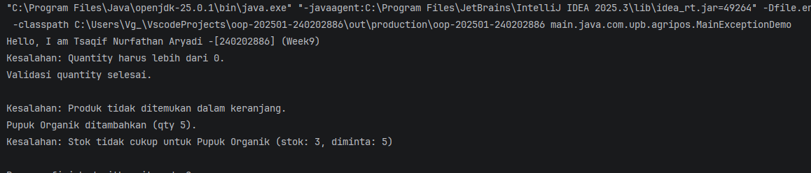

# Laporan Praktikum Minggu 9 
Topik: Exception Handling, Custom Exception, dan Penerapan Design Pattern

## Identitas
- Nama  : [Tsaqif Nurfathan Aryadi]
- NIM   : [240202886]
- Kelas : [3IKRB]

---

## Tujuan

    1.Menjelaskan perbedaan antara error dan exception.
    2.Mengimplementasikan try–catch–finally dengan tepat.
    3.Membuat custom exception sesuai kebutuhan program.
    4.Mengintegrasikan exception handling ke dalam aplikasi sederhana (kasus keranjang belanja).
    5.(Opsional) Menerapkan design pattern sederhana (Singleton/MVC) dan unit testing dasar.


---

## Dasar Teori
1. Error vs Exception

   Error → kondisi fatal, tidak dapat ditangani (contoh: OutOfMemoryError).
   Exception → kondisi tidak normal yang dapat ditangani oleh program.

2. Struktur try–catch–finally

   try {
   // kode yang berpotensi menimbulkan kesalahan
   } catch (Exception e) {
   // penanganan
   } finally {
   // blok yang selalu dijalankan
   }

3. Membuat Custom Exception

    package com.upb.agripos;
    
    public class InvalidQuantityException extends Exception {
         public InvalidQuantityException(String message) {
              super(message);
         }
    }

---

## Langkah Praktikum
(Tuliskan Langkah-langkah dalam prakrikum, contoh:

    1.Langkah-langkah yang dilakukan (setup, coding, run).
    2.File/kode yang dibuat.
    3.Commit message yang digunakan.)
Studi Kasus Agri-POS: Keranjang Belanja

Keranjang belanja harus memvalidasi:

    -Jumlah pembelian > 0
    -Produk ada dalam keranjang
    -Stok mencukupi

Kesalahan–kesalahan tersebut ditangani menggunakan custom exception.

---

## Kode Program
(Tuliskan kode utama yang dibuat, contoh:  

```java
/1.InsufficientStockException.java

package com.upb.agripos;

public class InsufficientStockException extends Exception {
    public InsufficientStockException(String msg) { super(msg); }
}

2. Product.java

package com.upb.agripos;

public class Product {

    private final String code;
    private final String name;
    private final double price;
    private int stock;

    public Product(String code, String name, double price, int stock) {
        this.code = code;
        this.name = name;
        this.price = price;
        this.stock = stock;
    }

    public String getCode() { return code; }
    public String getName() { return name; }
    public double getPrice() { return price; }
    public int getStock() { return stock; }

    public void reduceStock(int qty) {
        this.stock -= qty;
    }

    // penting untuk Map
    @Override
    public boolean equals(Object o) {
        if (this == o) return true;
        if (!(o instanceof Product)) return false;
        Product p = (Product) o;
        return code.equals(p.code);
    }

    @Override
    public int hashCode() {
        return code.hashCode();
    }
}
```
3. ShoppingCart.java
```
package com.upb.agripos;

import java.util.HashMap;
import java.util.Map;

public class ShoppingCart {

    private final Map<Product, Integer> items = new HashMap<>();

    // tambahProduk
    public void addProduct(Product product, int qty)
            throws InvalidQuantityException {

        if (qty <= 0) {
            throw new InvalidQuantityException("Quantity harus lebih dari 0.");
        }

        items.put(product, items.getOrDefault(product, 0) + qty);
        System.out.println(product.getName() + " ditambahkan (qty " + qty + ").");
    }

    // hapusProduk
    public void removeProduct(Product product)
            throws ProductNotFoundException {

        if (!items.containsKey(product)) {
            throw new ProductNotFoundException(
                "Produk tidak ditemukan dalam keranjang."
            );
        }

        items.remove(product);
        System.out.println(product.getName() + " dihapus dari keranjang.");
    }

    // checkout
    public void checkout() throws InsufficientStockException {

        for (Map.Entry<Product, Integer> entry : items.entrySet()) {
            Product p = entry.getKey();
            int qty = entry.getValue();

            if (p.getStock() < qty) {
                throw new InsufficientStockException(
                    "Stok tidak cukup untuk " + p.getName() +
                    " (stok: " + p.getStock() + ", diminta: " + qty + ")"
                );
            }
        }

        // pengurangan stok
        for (Map.Entry<Product, Integer> entry : items.entrySet()) {
            entry.getKey().reduceStock(entry.getValue());
        }

        System.out.println("Checkout berhasil. Stok diperbarui.");
    }
}
```
4. MainExceptionDemo.java
```
package com.upb.agripos;

public class MainExceptionDemo {

    public static void main(String[] args) {

        System.out.println("Hello, I am Leila Aristawati-[240202901] (Week9)");

        ShoppingCart cart = new ShoppingCart();
        Product pupuk = new Product("P01", "Pupuk Organik", 25000, 3);

        // 1. Invalid quantity
        try {
            cart.addProduct(pupuk, -1);
        } catch (InvalidQuantityException e) {
            System.out.println("Kesalahan: " + e.getMessage());
        } finally {
            System.out.println("Validasi quantity selesai.\n");
        }

        // 2. Remove product not in cart
        try {
            cart.removeProduct(pupuk);
        } catch (ProductNotFoundException e) {
            System.out.println("Kesalahan: " + e.getMessage());
        }

        // 3. Insufficient stock
        try {
            cart.addProduct(pupuk, 5);
            cart.checkout();
        } catch (Exception e) {
            System.out.println("Kesalahan: " + e.getMessage());
        }
    }
}
```
---


## Hasil Eksekusi
(Sertakan screenshot hasil eksekusi program.  

)
---

## Analisis
(
    Jelaskan bagaimana kode berjalan.

Jawaban: Program menggunakan collection (List/Map) untuk menyimpan data produk di dalam keranjang belanja. Saat produk ditambahkan, sistem menyimpan objek produk beserta jumlahnya ke dalam keranjang, lalu menghitung total harga berdasarkan isi koleksi tersebut. Operasi seperti tambah, hapus, dan menampilkan isi keranjang dilakukan dengan mengakses dan memanipulasi koleksi.

    Apa perbedaan pendekatan minggu ini dibanding minggu sebelumnya.

Jawaban: Minggu ini fokus pada pengelolaan data dinamis menggunakan collection (seperti List atau Map) untuk menampung banyak objek dalam satu struktur, khususnya pada fitur keranjang belanja.

    Kendala yang dihadapi dan cara mengatasinya. _

---

## Kesimpulan
 konsep exception handng di gunakan untuk menangani kesalahan yang dapat terjadi saat program berjalan 

---

## Quiz
1.jelaskan perbedaan error dan exception
Jawaban: Error adalah kesalahan serius yang terjadi di luar kendali program dan biasanya tidak dapat ditangani, seperti masalah memori.Exception adalah kesalahan yang masih bisa ditangani oleh program, misalnya input tidak valid atau data tidak ditemukan.

2.Apa fungsi finally dalam blok try–catch–finally?
Jawaban: Blok finally digunakan untuk mengeksekusi kode yang pasti dijalankan, baik terjadi exception maupun tidak, seperti menutup resource atau menampilkan pesan akhir

3.Mengapa custom exception diperlukan? Jawaban: Custom exception diperlukan agar kesalahan yang terjadi lebih spesifik dan mudah dipahami, sesuai dengan aturan bisnis aplikasi, sehingga penanganan error menjadi lebih jelas dan terstruktur.

4.Berikan contoh kasus bisnis dalam POS yang membutuhkan custom exception. Jawaban: Contohnya adalah StokTidakCukupException, yang muncul ketika kasir mencoba menjual produk dengan jumlah melebihi stok yang tersedia di sistem POS

